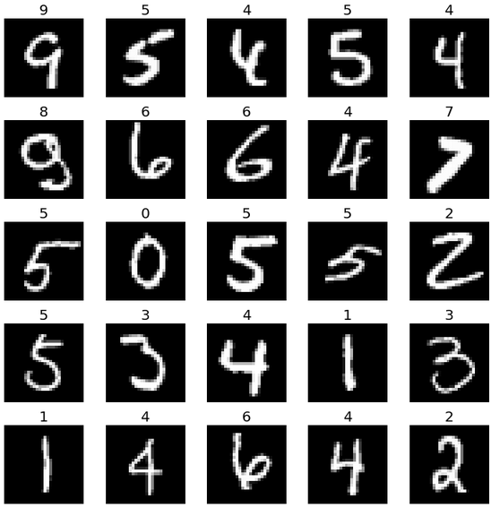
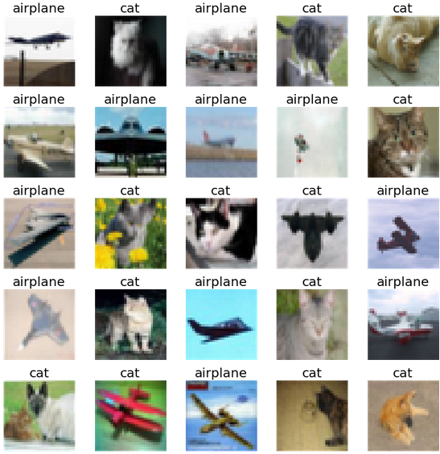

# logreg_classifier

A vectorized python code for classifying objects based on a set of input features using logistic regression.
The number of input features and the order for the decision boundary polynomial are variable.
The code classifies objects either into two classes ("BinaryClass") or more than two classes ("MultiClass")
using a combination of binary classifications.

# example notebooks

- classification of galaxies into morphological types (elliptical, disky, irregular) based on color and luminosity:

  https://colab.research.google.com/drive/15qtFJbhFwl7NIEb8-D3Hw58cbbNwbn0o?usp=sharing
  
  

- detect of numbers in images from MNIST database (using convolution and max pooling from KERAS)

  https://colab.research.google.com/drive/1QLKwmVS-szNWQ57yIyhIM6AfX3y4mUSt?usp=sharing
  
  
 
 - classifying images of cats and airplanes from CIFAR-10 database (using convolution from KERAS and PCA from scikit-learn)
https://colab.research.google.com/drive/1E4fQdfPtqaZ3BLyg0oorxq4bIKmOFCSA?usp=sharing
  
  
